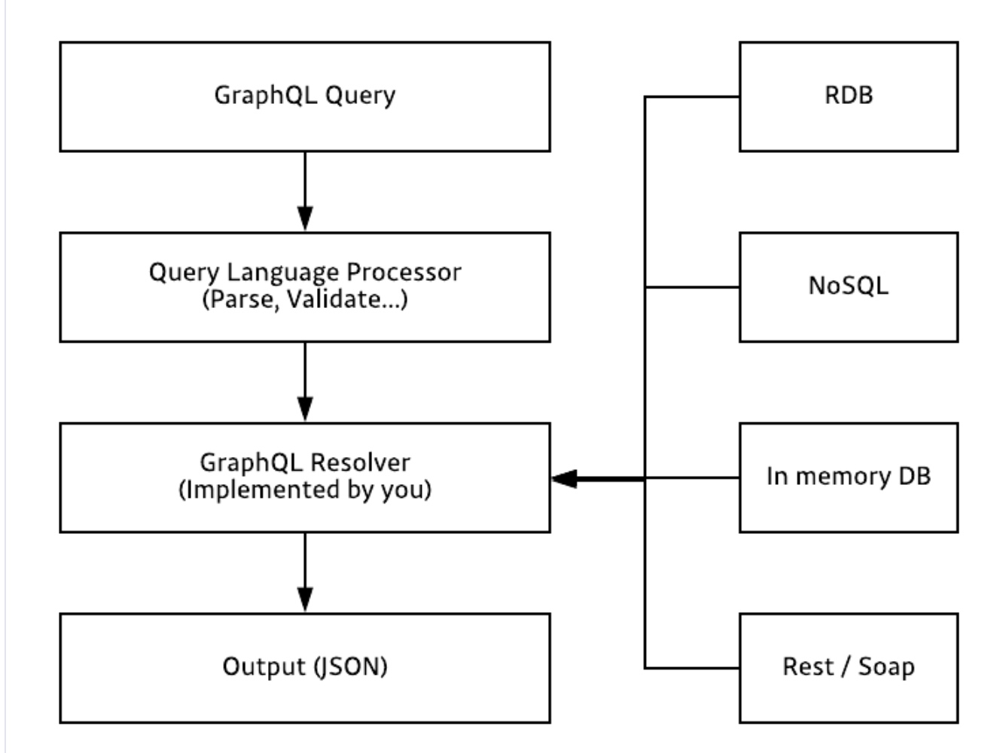
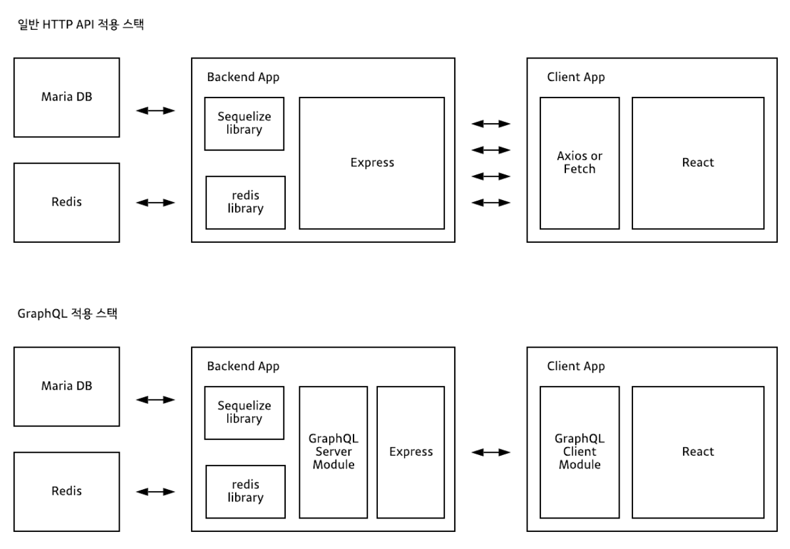

# NestJS-GraphQL-Board

<div align="center">
<a href="https://graphql.org/" target="blank"></a> <a href="https://www.prisma.io/" target="blank"></a> <a href="http://nestjs.com/" target="blank"></a>

NestJS 프레임워크와 `GraphQL`을 사용하여 간단한 CRUD 시스템을 개발해보자

클린 코드를 사용하여 문서화까지, 가능하다면 프론트를 붙여서 화면까지 띄어보는걸로

</div>

# GrapQL 이란 ?

GraphQL이란 SQL와 마찬가지로 쿼리 언어이다.

하지만 GQL(GraphQl)과 SQL의 언어적 구조 차이는 매우 크다, 또한 gql과 sql이 실전에서 쓰이는 방식의 차이도 매우 크다

sql은 데이터베이스 시스템에 저장된 데이터를 효율적어로 가져오는것이 목적이라면

gql은 웹 클라이언트가 데이터를 서버로 부터 효율적으로 가져오는 것이 목적이다

```SQL
SELECT * user_id, user_name, age FROM USER
```

_sql 쿼리 예시_

```GQL
{
    user{
        user_id
        user_name
        age
    }
}
```

_gql 쿼리 예시_

<br>

# Server side GQL ?

**서버사이드 gql 어플리케이션은** gql로 작성된 쿼리를 입력으로 받아 쿼리를 처리한 결과를 다시 클라이언트에게 돌려준다

HTTP API자체가 특정 데이터베이스나 플렛폼에 종속적이지 않은것 처럼 마찬가지로 gql역시 어떤 특정 데이터베이스나 플랫폼에 종속적이지 않다 심지어 네트워크 방식에도 종속적이지 않다.

일반적으로 gql의 인터페이스간 송수신은 네트워크 레이어 L7의 HTTP POST 메서드와 웹소켓 프로토콜을 활용한다

- **GraphQL Piple Line**



# GraphQL vs REST API

- `Rest API`

  - URL, METHOD 조합으로 다양한 `Endpoint`가 존재
  - REST API에서는 각 EndPoint마다 데티어베이스 SQL 쿼리 자체가 달라짐

- `GraphQL(gql)`
  - gql은 단 하나의 EndPoint가 존재
  - gql API는 gql 스키마의 타입마다 데이터베이스 SQL 쿼리가 다름



> gql API를 사용하면 여러번 네트워크 호출 할 필요 없이, 한번의 네트워크 호출로 처리가 가능하다.
